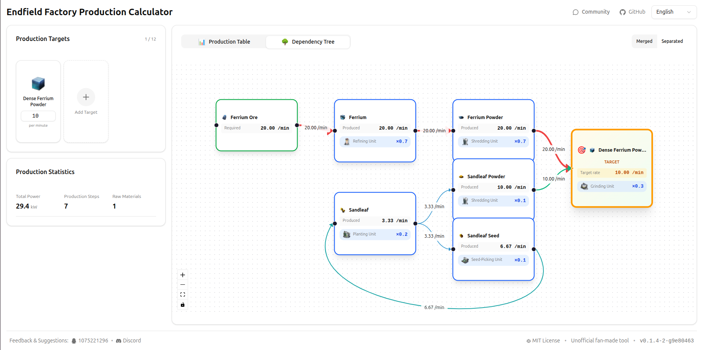

# Endfield Tool — Production Calculator for "Arknights: Endfield"

[中文](./README_zh.md)

[](https://jamboChen.github.io/endfield-tool)
[](https://discord.gg/6V7CupPwb6)
[](LICENSE)




## Overview

Endfield Tool is a comprehensive production planning and optimization calculator for **Arknights: Endfield**. It helps players design efficient production chains by calculating resource requirements, facility needs, and handling complex recipe dependencies—including circular production loops.

## Key Features

### 🎯 Production Planning
- **Multi-target planning**: Set multiple production goals with custom output rates
- **Automatic dependency resolution**: Recursively calculates all required intermediate items and raw materials
- **Real-time recalculation**: Instantly updates when you change targets, recipes, or configurations

### 🔄 Smart Recipe Management
- **Intelligent recipe selection**: Automatically chooses optimal recipes while avoiding problematic circular dependencies
- **Manual recipe override**: Lock specific recipes for items when you want full control
- **Circular dependency handling**: Detects and solves circular production chains (e.g., items that require themselves as inputs) using mathematical steady-state analysis

### 🏭 Facility Optimization
- **Facility count calculation**: Determines exact number of facilities needed for each production step
- **Power consumption tracking**: Monitors total power requirements across your production chain
- **Tier-based organization**: Groups and sorts production by facility tier and dependency depth

### 📊 Dual Visualization Modes

#### Table View
- Comprehensive production line breakdown with sortable columns
- Shows item output rates, facilities needed, recipe selection, and raw material status
- Quick recipe switching via dropdown menus
- One-click manual raw material marking

#### Dependency Tree View
- **Interactive flow diagram**: Visualize your complete production chain as a connected graph
- **Merged mode**: Consolidates duplicate items to show aggregate requirements
- **Separated mode**: Displays full dependency tree with all production paths
- **Cycle visualization**: Special rendering for circular recipes with backward flow indicators
- **Level-based layout**: Automatically arranges nodes by production depth for clarity

### 🎨 Manual Supply Chain Control
- **Mark items as raw materials**: Stop dependency expansion at any point in the chain
- **Flexible sourcing**: Perfect for planning factories with external suppliers or existing production setups
- **Quick toggle**: Enable/disable manual sourcing directly from the production table

### 🌐 Internationalization
- Multi-language support 

## Technology Stack

- **Framework**: React 18 + TypeScript
- **Build Tool**: Vite
- **Visualization**: React Flow (for dependency trees)
- **UI Components**: Radix UI primitives + custom components
- **Styling**: Tailwind CSS
- **State Management**: React hooks (useState, useMemo, useCallback)
- **i18n**: react-i18next

## Getting Started

### Try Online (Recommended)

Visit **[https://jamboChen.github.io/endfield-tool](https://jamboChen.github.io/endfield-tool)** to use the app directly in your browser—no installation required!

### Local Development

If you want to contribute or run it locally:

#### Installation
```bash
# Clone the repository
git clone https://github.com/JamboChen/endfield-tool.git
cd endfield-tool

# Install dependencies
pnpm install

# Start development server
pnpm run dev
```

## Data Source & Disclaimer

- **Data Source**: All item, recipe, and facility data are sourced from [endfield.wiki.gg](https://endfield.wiki.gg)
- **Accuracy Notice**: The tool's calculations are based on wiki data and are **for reference only**. Game mechanics or data may change. Please verify critical production plans in-game.
- **Community Maintained**: Data accuracy depends on wiki contributors. If you find errors, please report them or contribute corrections to the wiki.

## Contributing

Contributions are welcome! Please see [CONTRIBUTING.md](CONTRIBUTING.md) for guidelines.

## License

MIT License - see [LICENSE](LICENSE) file for details.

---

**Note**: This is a fan-made tool and is not officially affiliated with Arknights: Endfield.
